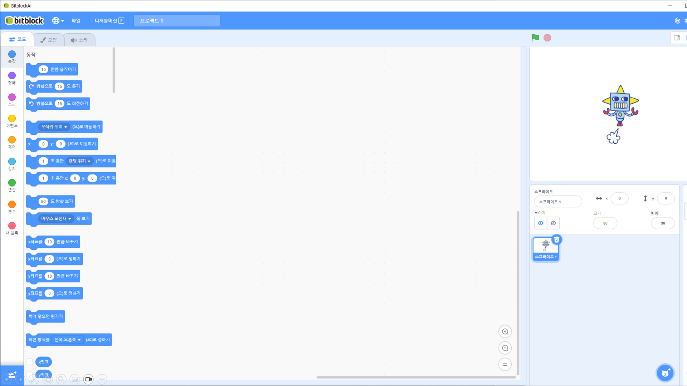
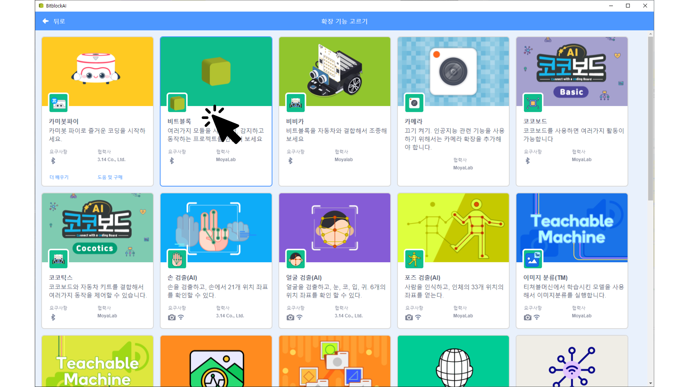
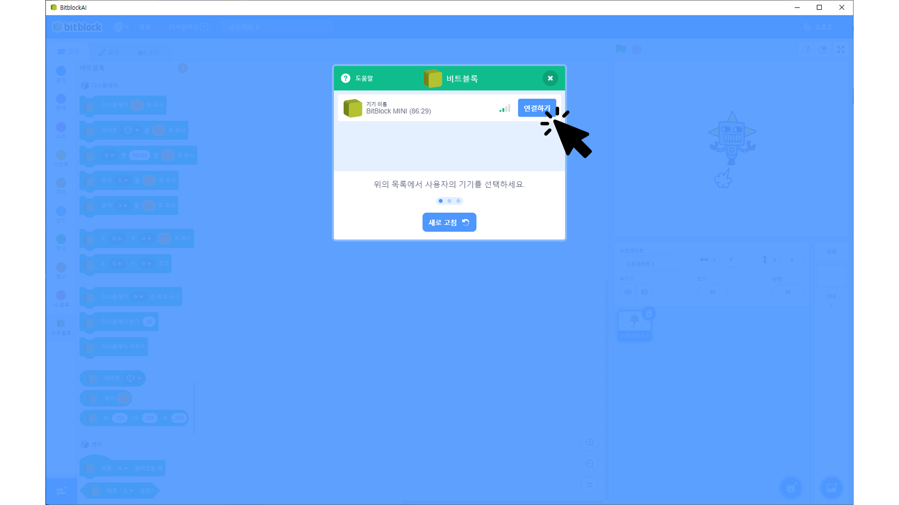
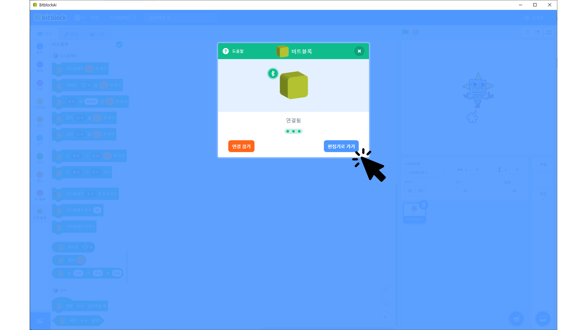
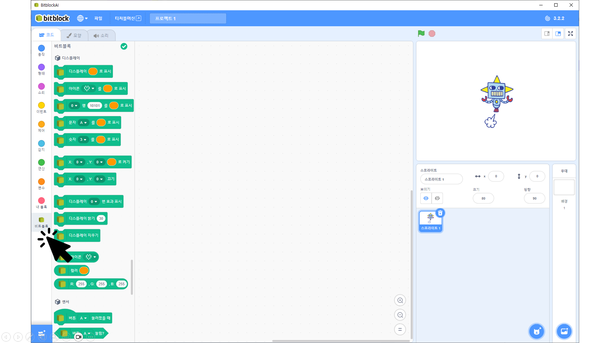
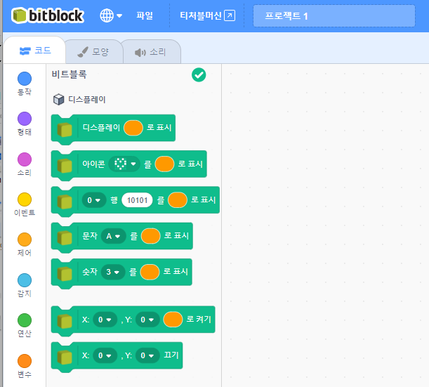
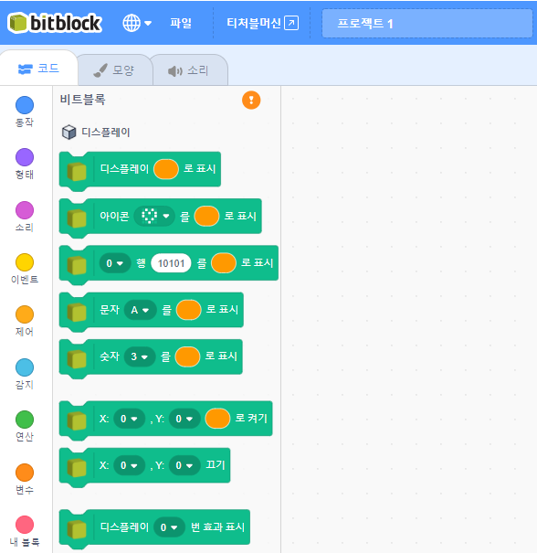

# 보드 연결

### 연결 대기상태

비트블록 보드에 전원이 연결되어, 대기상태를 확인한다.


블루투스 연결 대기


### 비트블록AI 실행

설치된 비트블록AI 프로그램을 실행하면 아래와 화면이 나타난다.

<figure><figcaption>
메인 화면
</figcaption></figure>

### 비트블록보드 확장 추가

확장 추가 버튼을 클릭해서 확장 선택 화면으로 이동한다.  \[비트블록]을 선택한다.

<figure><figcaption>
확장 기능 선택
</figcaption></figure>

PC (블루투스 동글)와 가장 가까이에 있는 비트블록 보드 한 개를 표시한다. 비트블록 보드를 PC와 가까운 위치로 가져가야지만 보드가 검색이 된다.


PC에 블루투스 기능이 없는 경우는, 블루투스 동글을 사용할 수 있다.


<figure><figcaption>
보드 연결
</figcaption></figure>

\[연결하기 ]버튼을 클릭하면, 보드와 연결 후 아래 화면이 나타난다.

<figure><figcaption>
보드 연결 완료
</figcaption></figure>

\[편집기로 가기] 버튼을 클릭해서 프로그래밍 편집 화면으로 이동한다.

<figure><figcaption></figcaption></figure>

비트블록 보드 관련 블록을 사용해서 프로그래밍이 가능해진다.

### 보드와 연결 상태 확인

블록 패널의 윗 부분 있는 체크 아이콘이 현재 보드의 연결 상태를 나타낸다.&#x20;

<figure><figcaption>
보드 연결됨
</figcaption></figure> <figure><figcaption>
보드 연결 안됨
</figcaption></figure>

