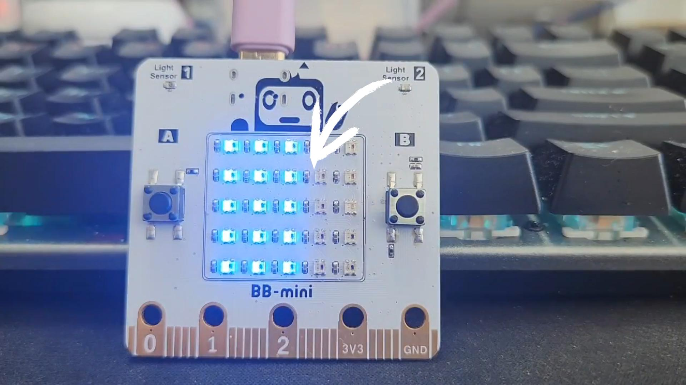

# 보드 명칭

<figure><figcaption>
비트블록 보드
</figcaption></figure>

<figure><figcaption>
비트블록 보드 명칭
</figcaption></figure>

1. 크기 : 50mm(W) x 50mm(H)
2. 무게: 14g
3. 마이크로프로세서:  ESP32-S3&#x20;
4. 동작 전압 : 3.3V
5. 무선통신: 블루투스 5
6. USB : USB-C타입 (데이터 통신, 전원 연결)


마이크로비트(Microbit)와 같은 형태의 인터페이스를 가지고 있습니다.

