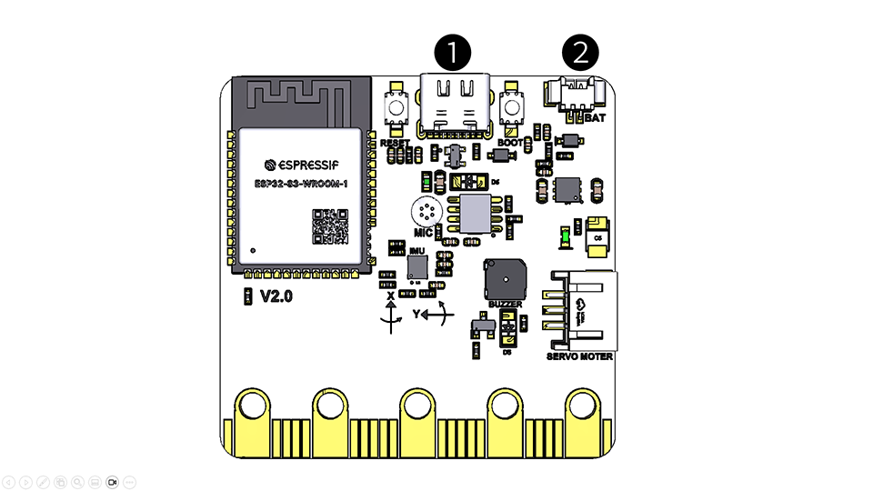

# 전원공급

비트블록 보드에는 2가지 방법으로 전원을 공급할 수 있다. 두 가지 방법 중에서 한 가지 방법으로 전원을 공급하면 된다.

<figure><figcaption>
비트블록 보드 뒷면
</figcaption></figure>

1. USB-C케이블을 PC의 USB 포트와 연결해서 사용 (출력 5V)
2. 비트블록 보드와 함께 제공되는 배터리 케이스를 사용 (AAA 건전지 3개 사용)
