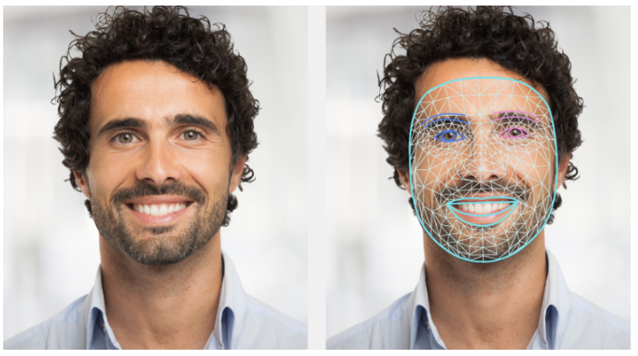

# 👦얼굴 검출

###

<figure><figcaption></figcaption></figure>

### 1. 코드 작성

```python
from helloai import *

wnd = Window('wnd')
camera = Camera()

detector = FaceDetector()

def loop():
    img = camera.read()

    # 24개의 랜드마크정보가 리턴된다. 
    img, landmarks = detector.process(img, draw=True)
    if len(landmarks) > 0:
        print(landmarks)
      
    wnd.show(img)

# ---------------------------------------
# for HelloAI
# ---------------------------------------
if __name__ == '__main__':
    run()
```

### 2. 랜드 마크&#x20;

<figure><figcaption></figcaption></figure>

