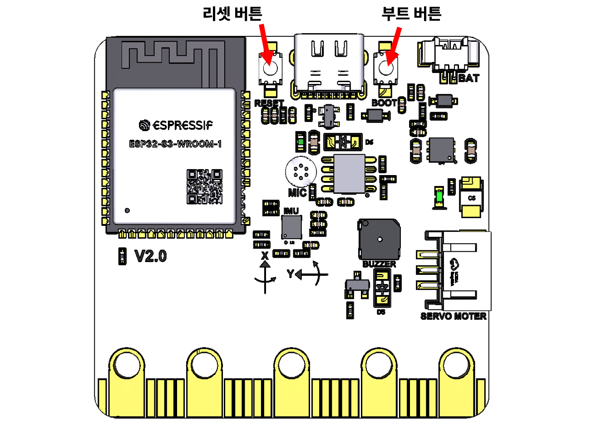
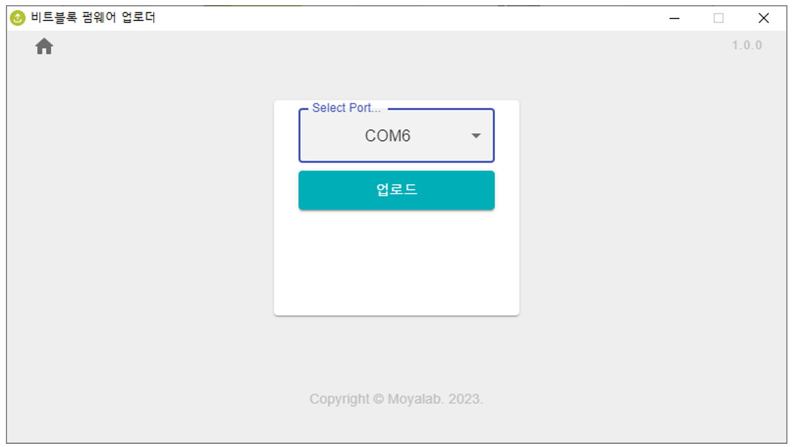
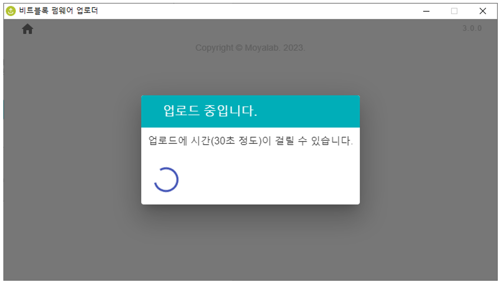
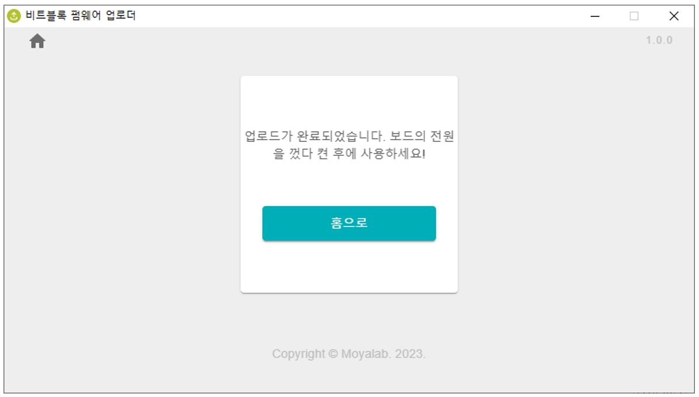

# 다운로드

### 다운로드

최신펌웨어 업로더 프로그램을 아래   링크에서 다운로드합니다.

#### 🔥 최신 버전&#x20;



#### 👽  이전버전



### 펌웨어 업로드&#x20;

#### 1. 보드의 업로드 모드 설정하기&#x20;

<figure><figcaption>
보드 뒷면
</figcaption></figure>

펌웨어 업로드를 위해서는 비트블록보드를 **업로드 모드**로설정해야 합니다. 업로드 모드는 보드에 전원을 연결한 상태(앞면에  Matrix LED가점멸하면서흐른다)에서, 보드 뒷면의 **부트 버튼을 누른 상태에서 리셋 버튼을 누릅니다.** 업로드 모드 에서는 보드 앞면의 Display(5x5 LED)가 동작을 멈춥니다. 이 상태가 업로드 모드입니다.   이      상태에서펌웨어업로드프로그램을실행합니다.

#### 2. 업로더 프로그램 실행하기

최신 버전의 업로더 프로그램을    실행합니다.&#x20;

<figure><figcaption></figcaption></figure>

\[비트블록보드] 를  선택합니다.

<figure><figcaption>
COM포트 선택
</figcaption></figure>

비트블록 보드가 연결된 COM포트를 선택합니다.  만약 비트블록 보드가 연결된 COM포트의 번호를 알 수 없다면, 윈도우의 \[장치관리자]화면에서 확인해야합니다.

업로드 버튼을 눌러서 업로드를 실행합니다.    &#x20;

<figure><figcaption>
업로드 중
</figcaption></figure>

일정 시간이 지나면 업로드가 완료됩니다.

<figure><figcaption>
업로드 완료
</figcaption></figure>

#### 3. 보드를 리셋하고 사용

업로드가 완료되면, 비트블록 보드를 리셋(전원을  끊었다  다시 켬)해서 사용한다.
