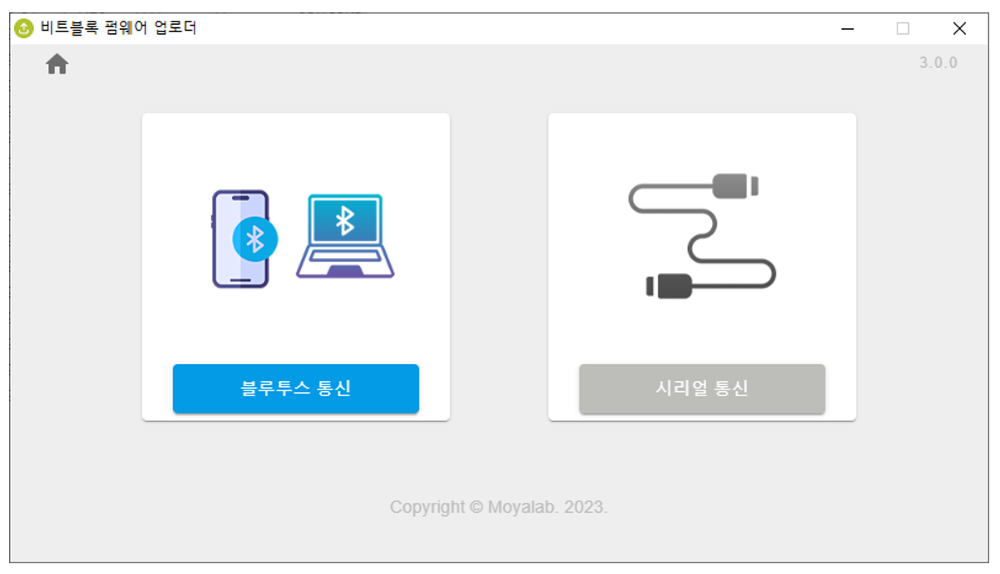

# 다운로드

### 다운로드

펌웨어 업로더 프로그램을 아래   링크에서 다운로드한다.



### 펌웨어 업로드

<figure><figcaption>
보드 뒷면
</figcaption></figure>

펌웨어 업로드를 위해서는 **업로드 모드**를 선택해야 한다. 업로드 모드는 보드에 전원을 연결한 상태에서, 보드 뒷면의 **부트 버튼을 누른 상태에서 리셋 버튼을 누른다**. 업로드 모드 에서는 보드 앞면의 Display(5x5 LED)가 동작을 멈춘다. 이 상태가 업로드 모드이다.

펌웨어 업로더 프로그램을 실행한다.

<figure><figcaption>
펌웨어 선택
</figcaption></figure>

펌웨어 종류를 선택한다. \[블루투스 통신] 버튼을 선택한다.

<figure><figcaption>
COM포트 선택
</figcaption></figure>

비트블록 보드가 연결된 COM포트를 선택한다. \[업로드] 버튼을 선택하면 업로드가 실행된다.

<figure><figcaption>
업로드 중
</figcaption></figure>

일정 시간이 지나면 업로드가 완료된다.

<figure><figcaption>
업로드 완료
</figcaption></figure>

업로드가 완료되면, 비트블록 보드를 리셋해서 사용한다.

