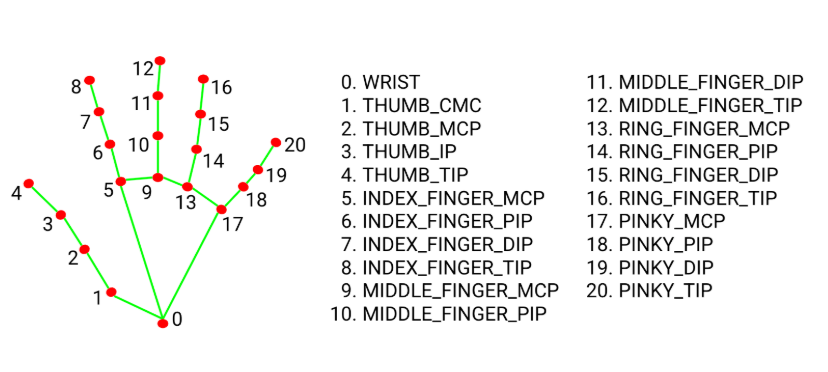
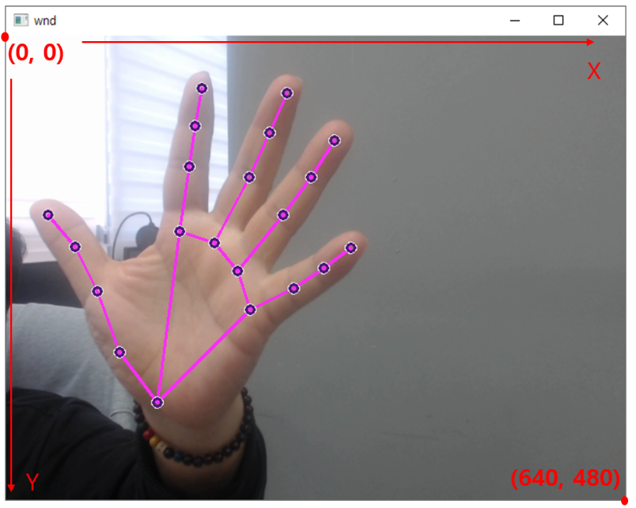

# 손검출

### 1. 코드작성

```python
# 실행 : 터미널에서 python 파일명
# 프로그램을 종료 터미널에서 Ctrl + C 키를 입력한다.

from helloai import *

wnd = Window('wnd')

# 카메라 객체 생성 
camera = Camera()

# 손 검출을 위한 객체 생성 
hands = HandsDetector()

def loop():
    img = camera.read()

    # 카메라에서 읽어온 이미지에서 손을 검출하고, 랜드마크의 위치를 그린다.
    # 랜드마크가 표시된 이미지,  랜드마크의 정보가 리턴된다. 
    img, landmarks = hands.process(img, draw=True)
    if len(landmarks) > 0:
        print(landmarks)

    wnd.show(img)

# ---------------------------------------
# For HelloAI
# ---------------------------------------
if __name__ == '__main__':
    run()
```

<figure><figcaption></figcaption></figure>

### 2. 화면의 좌표

랜드마크의 정보를 정확히 이해하기 위해서는 이미지가 표시되는 윈도우의 좌표 체계를 이해해야한다. 카메라에서 입력되는 이미지의 크기가 640x480의 경우를 아래에 표시했다

<figure><figcaption></figcaption></figure>

왼쪽 위가 (0, 0) 이며, 아래로 갈수록 , 오른쪽으로 갈수록 값이 커진다.
