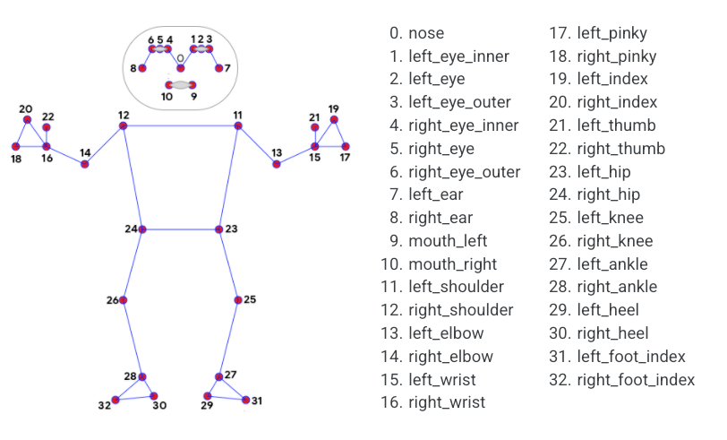

# 🙋인체 검출

###

<figure><figcaption></figcaption></figure>

### 1. 코드 작성&#x20;

```python
from helloai import *

wnd = Window('wnd')
camera = Camera()
detector = PoseDetector()

def loop():
    img = camera.read()

    # 인체 감지 처리
    # 랜드마트가 그려진 이미지, 33개의 랜드마크 정보가 리턴된다. 
    img, landmarks = detector.process(img, draw=True)
 
    # 이미지 윈도우에 표시 
    wnd.show(img)

# ---------------------------------------
# for HelloAI
# ---------------------------------------
if __name__ == '__main__':
    run()
```

### 2. 랜드마크

HelloAI는 거울에 비춰진 형태라고 생각하면 이해하기 쉽다. 실제의 랜드마크 좌표값과 번호를 맞춰보는 것이 중요하다.

<figure><figcaption></figcaption></figure>
