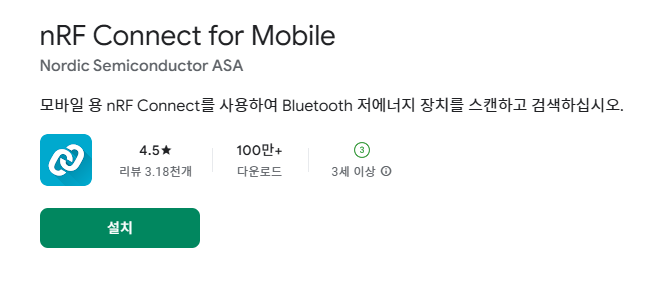
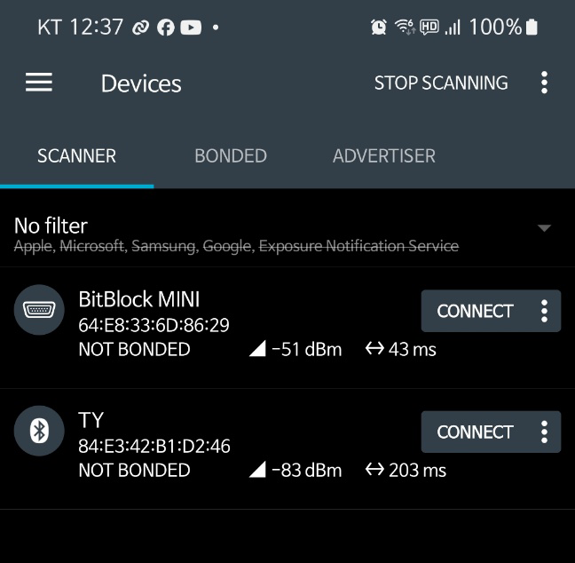

# 🤖 MAC 주소 확인

### MAC 주소 확인

비트블록 보드의 MAC 주소를 확인하는 방법은 스마트폰 앱을 이용하면 편리하다. &#x20;

<figure><figcaption></figcaption></figure>

nRF Connect for Mobile 앱을 설치하고, 실행한다.

<figure><figcaption></figcaption></figure>

비트블록 보드는 "BitBlock MINI"라는 이름으로 검색된다. 그 아래에 있는 "64:E8:33:6D:86:29" 가 MAC 주소이다. 이 MAC 주소를 사용해서 파이썬 코드에서 비트블록에 연결한다.&#x20;

