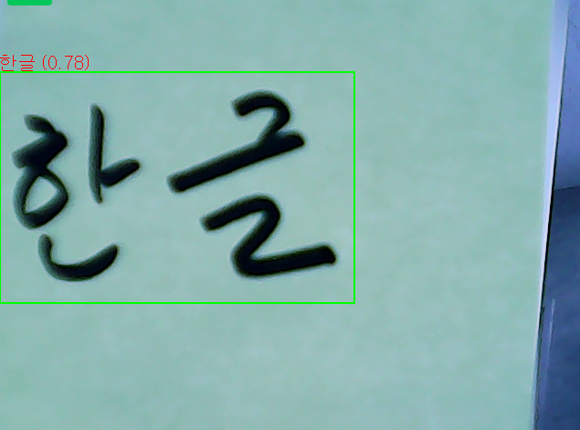

# 글자 인식

한글과 영어를 인식하는 기능이다. 정확도나 기능이 뛰어나지 않으므로 항상 테스트를 해가면서 사용하기 바랍니다.

### 1. 전체 코드

```python
from helloai import *

win = Window("wnd")
# 카메라 객체
camera = Camera()
ocr = OCR()


def loop():
    img = camera.read()
    results, img = ocr.readtext(img.flip('h'))

    # 윈도우에 이미지 표시 
    win.show(img)
    

# ---------------------------------------
# For HelloAI
# ---------------------------------------
if __name__ == "__main__":
    run()
```

카메라에 한글이 적힌 종이를 인식 시킨다. results 에 인식 결과가 담겨져 있다.

<figure><figcaption></figcaption></figure>

